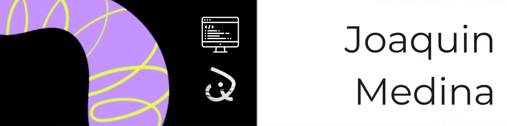

<!--  -->

#  Hola a todos!

✨Soy Joaquín Medina desarrollador web fullstack. Tengo experiencia desarrollando proyectos freelance y académicos. Orientado al front-end, tengo sólidos conocimientos en tecnologías como React, JavaScript, HTML, CSS y frameworks como Tailwind y Bootstrap. Además, tengo experiencia en back-end utilizando Node.js, Express, Sequelize y Mongoose. Mi pasión por crear soluciones tecnológicas y mi compromiso con el aprendizaje continuo impulsan mi búsqueda de conocimiento y experiencia.  
🎉💻Estoy siempre en busca de nuevas colaboraciones y oportunidades para llevar la creatividad y el diseño a nuevos niveles. Si estás interesado en saber más sobre cómo puedo ayudarte no dudes en contactarme!

<h3 align="center">💻Habilidades:</h3>

<table align="center">
          <tr>
            <td align="center">
              <h6>
HTML      
</h6>
            </td>
            <td align="center">
              <h6>
CSS       
</h6>
            </td>
            <td align="center">
              <h6>
Bootstrap       
</h6>
            </td>
            <td align="center">
              <h6>
Tailwind       
</h6>
            </td>
            <td align="center">
              <h6>
JavaScript
</h6>
            </td>
            <td align="center">
              <h6>
Git   
</h6>
            </td>
            <td align="center">
              <h6>
React     
</h6>
            </td>
            <td align="center">
              <h6>
Redux     
</h6>
            </td>
          </tr>
          <tr>
            <td align="center">
              <h6>
Mongo     
</h6>
            </td>
            <td align="center">
              <h6>
Mongoose
</h6>
            </td>
            <td align="center">
              <h6>
Node      
</h6>
            </td>
            <td align="center">
              <h6>
Express   
</h6>
            </td>
            <td align="center">
              <h6>
Java 
</h6>
            </td>
            <td align="center">
              <h6>
Sequelize 
</h6>
            </td>
            <td align="center">
              <h6>
PostgreSQL
</h6>
            </td>
            <td align="center">
              <h6>
MySQL
</h6>
            </td>
          </tr>
        </table>
